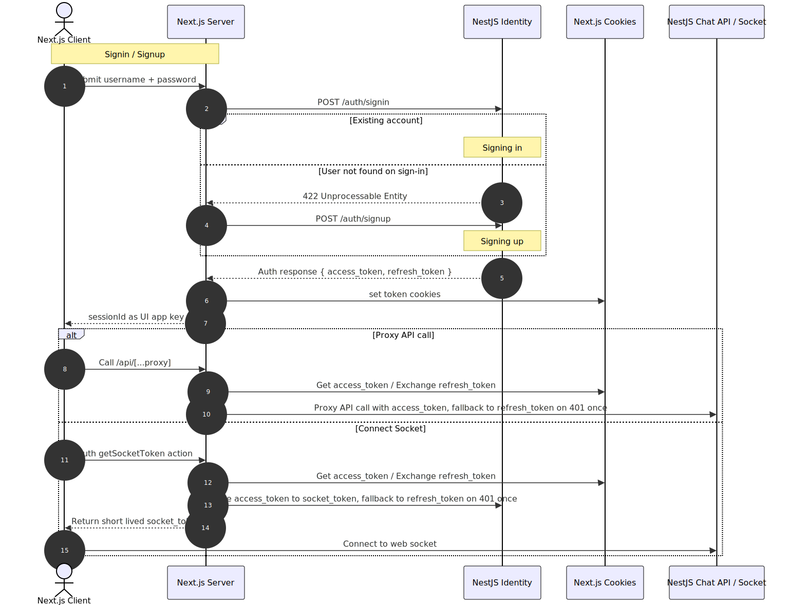
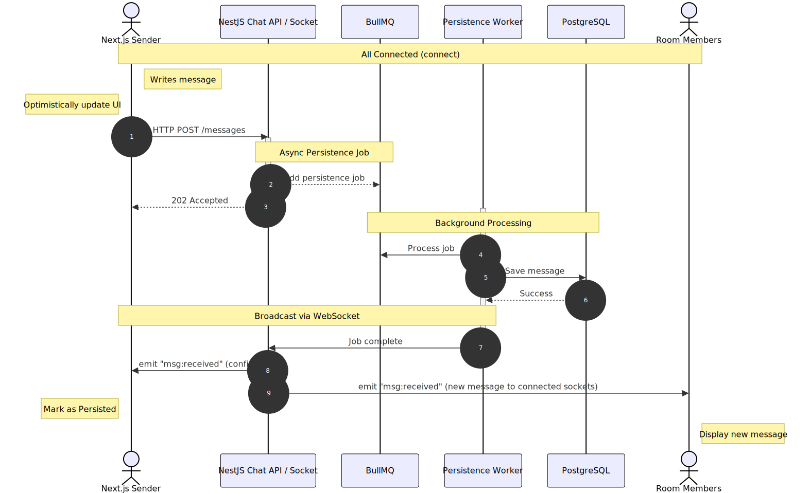
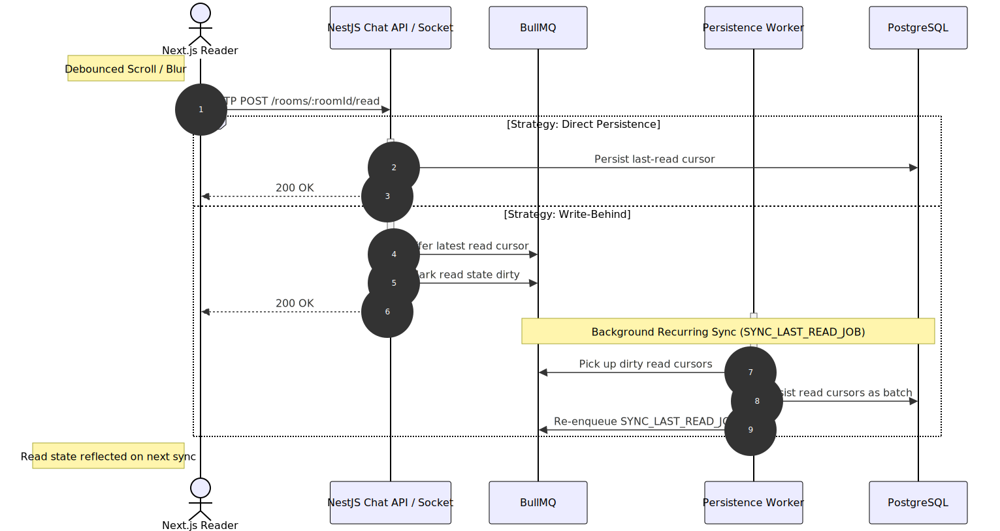

# Chat in a box

Playground project covering real-time and async processing patterns using a distributed chat messaging application as a business domain.

## Points of Interest

* Persistent DM and Group rooms
* Cursor bidirectional pagination, infinity message threads 
* Unread message trackers, notifications
* Async persistence message jobs
* Tokenized auth
* Load/performance tests with k6 and chat activity simulation
* Observability and containerization

## Tech Stack

* Next.js / React, TanStack Query, Tailwind, Radix / Shadcn
* NestJS, Socket.IO, BullMQ, Drizzle
* Redis, PostgreSQL
* Contracts via Zod
* Package builds with tsdown
* Vitest, k6
* Turborepo
* Traefik, Prometheus, Grafana, Loki, Alloy + Exporters, Ofelia for Scheduling

## Run

### Infrastructure:
- Prepare `.env` file
- `make infra` will spin up Redis and PostgreSQL containers

### Standalone:
- `pnpm push` to apply SQL schema
- `pnpm seed` for tests / `pnpm seed:full` for load simulation 
- `pnpm dev` / `pnpm build`

### Simulation:
- `pnpm simulator` to run a process with virtual pre seeded users posting intervaled messages from a message pool, configurable via `.env` variables

### Tests:
- `pnpm test -F [packagename]` covers integration tests of NestJS app packages

### Docker:
- Generate certs for traefik https in `docker/traefik/certs`
- Prepare `docker/.env.docker` file
- Run infrastructure
- `make init` for pushing/seeding once
- `make up` starts all services behind Traefik
- `make obs` for observability stack
- `make perf SCENARIO=[scenario file path]` for k6 tests 
- `make simulator` for chat activity simulation

## Diagrams

Authentication Sequence

	

Sending Message Async Sequence

	

Reading Message Direct/Write-behind Sequence

	

